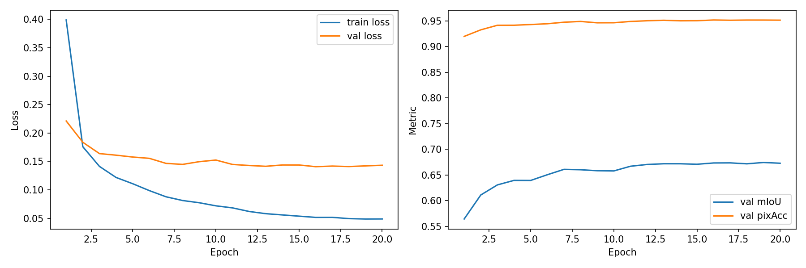
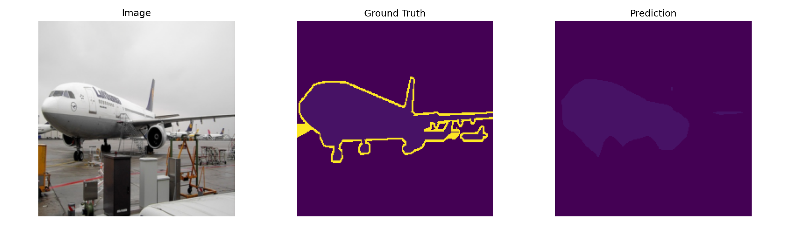

# 语义分割复现：DINOv2 + PSPNet

用 DINOv2（ViT-S/14，冻结 backbone）作为特征提取器，搭配 PSPNet 金字塔池化分割头，
在 PASCAL VOC 2012 语义分割数据集上训练并验证。

**最终结果：验证集 mIoU 67.5%，像素准确率约 95%**

## 1. 任务与思路

语义分割 = 给图中每个像素分类（VOC 2012 共 21 类：20 个前景类别 + 背景）。

整体思路是"**强特征 + 轻头部**"：

- **DINOv2** 是 Meta 用自监督方式在大规模无标注图片上预训练的 ViT，不需要任何人工标签
  就能学到非常通用的视觉特征；
- 冻结 DINOv2 作为特征提取器（backbone），只在上面训练一个轻量的 **PSPNet 分割头**；
- 这样既利用了自监督预训练的强大表征，又把训练开销压到最低（可训练参数仅约 13M）。

架构示意：

```
输入图片 (3×224×224)
   │
   ▼
DINOv2 ViT-S/14（冻结）
   │  16×16 = 256 个 patch token（384 维）
   ▼
reshape 成特征图 (384×16×16)
   │
   ▼
PSP 金字塔池化模块（可训练）
   │  4 路并行池化 (1×1 / 2×2 / 3×3 / 6×6)
   │  → 1×1 卷积降维 → 上采样回 16×16 → 拼接
   ▼
bottleneck 卷积 → 1×1 分类头
   │
   ▼
21 类逐像素预测（上采样回原分辨率）
```

## 2. 方法原理

### 2.1 DINOv2 backbone（冻结）

- ViT-S/14：约 21M 参数。图片按 14×14 的 patch 切分，224×224 输入得到 16×16 = 256 个
  patch token；
- 取 patch token（去掉序列最前面的 CLS token），reshape 成 (384, 16, 16) 的空间特征图；
- **训练全程冻结**：所有参数 `requires_grad=False`，并重写 `train()` 强制保持 `eval()` 模式。
  原因：① 自监督预训练特征本身质量很高；② 大幅降低显存占用和过拟合风险；③ 训练更快。

### 2.2 PSPNet 分割头（可训练）

PSPNet 的核心是**金字塔池化模块（Pyramid Pooling Module）**：用 4 种尺度的自适应平均
池化（1×1、2×2、3×3、6×6）并行提取从全局到局部的多层级上下文，各自经 1×1 卷积降维后
上采样回原特征图大小拼接，再过 bottleneck 卷积输出 21 类逐像素 logits。简单的说就是：
把 backbone 给出的特征图，用不同大小的池化窗口"压缩"成不同尺度的全局/局部信息，再通过
卷积和上采样统一拼回去，让分割头同时看到"大局"和"细节"。

直觉：分割"飞机机翼"这类大目标需要全局上下文，小目标依赖局部细节，金字塔池化把两者
一次性都交给分割头。

### 2.3 训练配置

| 项目 | 设置 |
| --- | --- |
| 数据集 | PASCAL VOC 2012 segmentation（约 1464 张训练图） |
| 输入分辨率 | 224×224（适配 patch_size = 14） |
| 优化器 | AdamW，lr = 1e-3，只优化分割头参数 |
| 学习率调度 | CosineAnnealingLR |
| batch size | 8 |
| 训练轮数 | 20 epochs |
| 损失函数 | 交叉熵 CrossEntropyLoss |

### 2.4 训练流程

每个 epoch 内，对 1464 张训练图反复执行：

1. **取 batch**：8 张图 + 对应标签，resize 到 224×224；
2. **前向传播**：图片 → 冻结的 DINOv2 提特征（384×16×16）→ PSP head 输出预测（21×224×224，即每个像素在 21 类上的分数）；
3. **算损失**：交叉熵——把预测的每个像素和真值标签逐像素对比，得到一个 loss 数字。交叉熵就是 loss = −ln(正确类别的概率)，越小越对，越大越错；
4. **反向传播**：从 loss 出发往回算梯度。梯度流到 backbone 处被截断（参数冻结），只有 head 的参数拿到梯度；
5. **更新参数**：AdamW 根据梯度微调 head 里约 13M 个参数；学习率从 1e-3 起按余弦曲线缓慢下降；
6. **每轮结束验证**：在验证集上算 mIoU，比之前好就保存 `best_head.pth`。

重复 20 个 epoch，训练曲线里 mIoU 一路爬到 67.5%，就是这个循环转 20 圈的结果。


## 3. 实验流程

1. 环境准备：PyTorch + transformers，登录 HuggingFace 拉取 `facebook/dinov2-small`；
2. 数据加载：VOC 2012，图片与标签统一 resize 到 224×224；
3. 模型搭建：DINOv2Backbone（冻结）+ PSPHead（金字塔池化 + 分类）；
4. 训练：每轮更新分割头，在验证集上计算 mIoU 并保存最优权重；
5. 评估：加载 `best_head.pth`，输出最终 mIoU / 像素准确率；
6. 可视化：训练曲线 + 原图 / 真值 / 预测三联对比图。

## 4. 结果

| 指标 | 数值 |
| --- | --- |
| 验证集 mIoU | **67.5%** |
| 像素准确率 | 约 95% |



数据分析：
左图：
蓝线 train loss 持续下降：从约 0.40 一路降到 0.05 左右。说明网络在训练集上越学越好，PSP 头里的参数一直在有效调整；
橙线 val loss 快速下降后基本平稳：从 0.22 降到 0.16 左右，在 epoch 3 之后基本不动。说明网络在没见过的新数据上也很快学到了主要规律，之后泛化能力基本稳定；
两条线之间有 gap：train loss 明显低于 val loss。这是正常现象，说明网络对训练集拟合得更紧一些，但差距不算大，没有严重过拟合；
右图：
mIoU 快速上升后平台化：从 0.56 左右爬到 0.67，之后基本稳定。这是因为网络先把“大体分对”学会，后面再优化细节，提升空间变小。
pixAcc 很早就饱和：从 0.92 涨到 0.95 后基本不动。原因是背景像素占了图像大部分，网络很早就能正确区分背景，导致整体像素正确率很高。
为什么 pixAcc 比 mIoU 高很多？
因为 pixAcc 容易被背景“刷分”。假设一张图里 90% 是背景，网络只要把所有像素都判成背景，pixAcc 就能到 90%，但飞机、人等前景类全错。mIoU 对每个类别平等看待，飞机、人等小目标错一点就会拉低分数。



预测样例：飞机主体与背景区分清晰，机翼轮廓完整，仅边缘小区域有少量噪声。

## 5. 关于 DINOv3 的说明

本任务原始要求使用 DINOv3 最小模型。DINOv3 权重是 Meta 的 gated repo（需逐人申请授权），
申请目前未获通过，因此先使用同系列的 **DINOv2-small** 完整验证训练与评估 pipeline。
两者使用方式一致（ViT backbone + patch token），授权通过后可直接替换 backbone 权重，
补齐 DINOv3 实验。

## 6. 文件说明

| 文件 | 内容 |
| --- | --- |
| `dinov2_pspnet_voc_best_head.pth` | 训练得到的最优分割头权重 |
| `dinov2_pspnet_voc_curves.png` | loss / mIoU 训练曲线 |
| `dinov2_pspnet_voc_prediction.png` | 原图 / 真值 / 预测 三联对比图 |

## 7. 环境

- Python 3.10+ / PyTorch 2.x（CUDA）
- transformers、torchvision、Pillow、matplotlib、tqdm

## 8. 参考

- DINOv2: Learning Robust Visual Features without Supervision (Meta AI, 2023)
- Pyramid Scene Parsing Network (PSPNet, CVPR 2017)
- The PASCAL Visual Object Classes Challenge 2012
