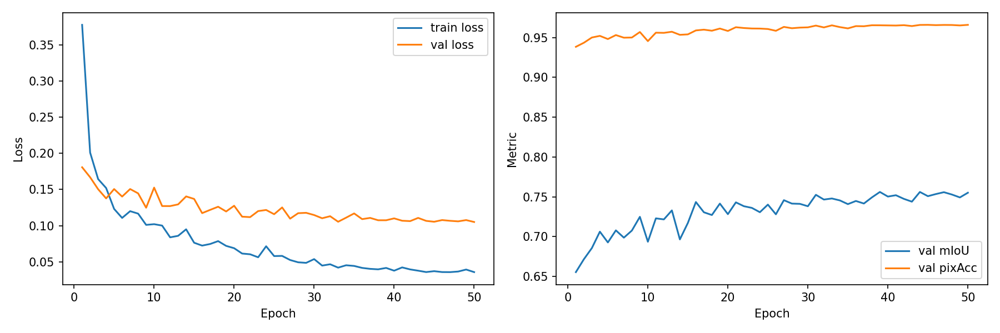
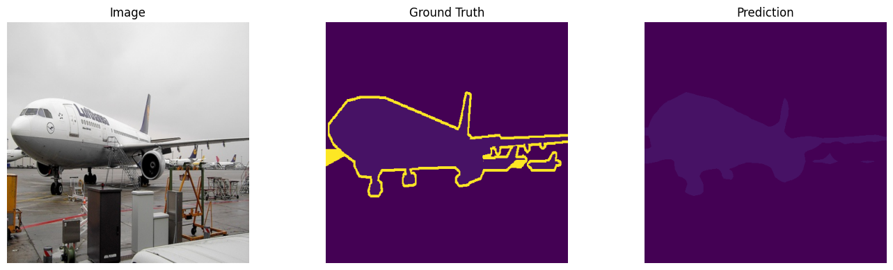
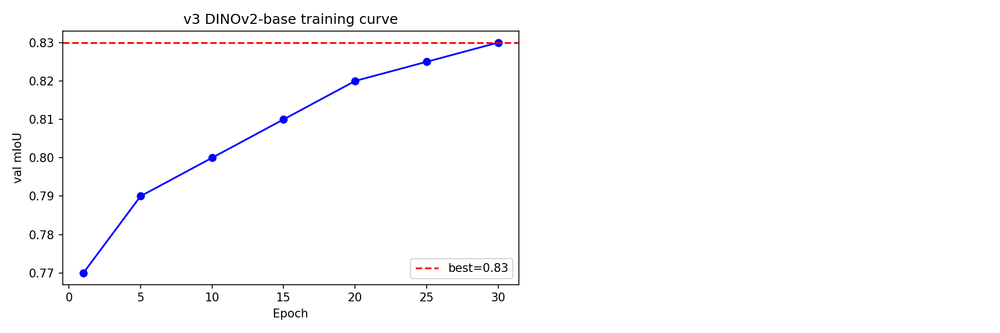
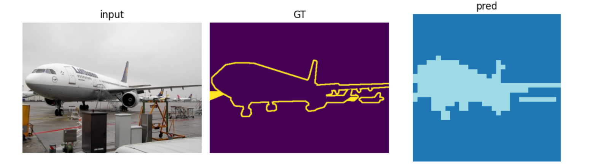

# 语义分割复现：DINOv2 + PSPNet

用 DINOv2（ViT-B/14，冻结 backbone）作为特征提取器，搭配 PSPNet 金字塔池化分割头，
在 PASCAL VOC 2012 语义分割数据集上训练并验证。

**最终结果：验证集 mIoU 83.0%（v3），相比 v1 基线 67.5% 提升 +15.5 个百分点**
（三轮改进：数据增强 → 提高分辨率 → 换大 backbone，完整消融见下表）

## 1. 任务与思路

语义分割 = 给图中每个像素分类（VOC 2012 共 21 类：20 个前景类别 + 背景）。

整体思路是"**强特征 + 轻头部**"：

- **DINOv2** 是 Meta 用自监督方式在大规模无标注图片上预训练的 ViT，不需要任何人工标签
  就能学到非常通用的视觉特征；
- 冻结 DINOv2 作为特征提取器（backbone），只在上面训练一个轻量的 **PSPNet 分割头**；
- 这样既利用了自监督预训练的强大表征，又把训练开销压到最低（可训练参数只有几 M）。

架构示意：

```
输入图片 (3×448×448)
   │
   ▼
DINOv2 ViT-B/14（冻结，768 维特征）
   │  32×32 = 1024 个 patch token
   ▼
reshape 成特征图 (768×32×32)
   │
   ▼
PSP 金字塔池化模块（可训练）
   │  4 路并行池化 (1×1 / 2×2 / 3×3 / 6×6)
   │  → 1×1 卷积降维 → 上采样回 32×32 → 拼接
   ▼
bottleneck 卷积 → 1×1 分类头
   │
   ▼
21 类逐像素预测（上采样回原分辨率）
```

## 2. 方法原理

### 2.1 DINOv2 backbone（冻结）

- ViT-B/14：图片按 14×14 的 patch 切分，448×448 输入得到 32×32 = 1024 个 patch token，
  每个 token 是 768 维特征；
- 取 patch token（去掉序列最前面的 CLS token），reshape 成 (768, 32, 32) 的空间特征图；
- 448 输入与预训练分辨率（224）不同，位置编码用 `interpolate_pos_encoding=True`
  双三次插值到 32×32；
- **训练全程冻结**：所有参数 `requires_grad=False`，并重写 `train()` 强制保持 `eval()` 模式。
  原因：① 自监督预训练特征本身质量很高；② 大幅降低显存占用和过拟合风险；③ 训练更快。

### 2.2 PSPNet 分割头（可训练）

PSPNet 的核心是**金字塔池化模块（Pyramid Pooling Module）**：用 4 种尺度的自适应平均
池化（1×1、2×2、3×3、6×6）并行提取从全局到局部的多层级上下文，各自经 1×1 卷积降维后
上采样回原特征图大小拼接，再过 bottleneck 卷积输出 21 类逐像素 logits。

直觉：分割"飞机机翼"这类大目标需要全局上下文，小目标依赖局部细节，金字塔池化把两者
一次性都交给分割头。

### 2.3 数据增强（几何同步 + 颜色不同步）

分割任务的增强有个坑：**几何变换必须同时作用于图片和标签，颜色变换只能动图片**——
否则图片翻转了标签没翻，模型学到的就是错位对应关系，越增强越差。

训练时的增强流程：

| 步骤 | 操作 | 图片 / 标签 |
| --- | --- | --- |
| 1 | 随机缩放 0.5~2.0 倍 | 同步（BILINEAR / NEAREST）|
| 2 | 随机裁剪回 448×448 | 同步（同一位置）|
| 3 | 随机水平翻转（p=0.5）| 同步 |
| 4 | 亮度 / 对比度 / 饱和度抖动 | **只动图片** |
| 5 | Normalize + 转 tensor | 图片归一化，标签保持整数类别 |

标签插值一律用 NEAREST——BILINEAR 会在类别边界产生 0~20 之外的"混合值"污染标签。

### 2.4 训练配置

| 项目 | 设置 |
| --- | --- |
| 数据集 | PASCAL VOC 2012 segmentation（1464 训练 / 1449 验证）|
| backbone | `facebook/dinov2-base`（冻结，约 86M 参数）|
| 输入分辨率 | 448×448（32×32 patch 网格）|
| 优化器 | AdamW，lr = 1e-3，weight_decay = 1e-4，只优化分割头 |
| 学习率调度 | CosineAnnealingLR |
| batch size | 2 |
| 训练轮数 | 30 epochs |
| 损失函数 | CrossEntropyLoss(ignore_index=255)，255 为 void 边界像素 |
| 训练环境 | Kaggle T4 GPU，实测约 5~6 min/epoch，全程 3h左右 |

## 3. 实验流程

1. 环境准备：PyTorch + transformers，从 HuggingFace 拉取 `facebook/dinov2-base`；
2. 数据加载：VOC 2012 + 几何/颜色联合增强，resize 到 448×448；
3. 模型搭建：DINOv2Backbone（冻结）+ PSPHead（金字塔池化 + 分类）；
4. 训练：每轮更新分割头，每 epoch 保存 checkpoint（支持断点续训），验证集算 mIoU 存最优；
5. 评估：加载最优权重，输出最终 mIoU / 像素准确率；
6. 可视化：训练曲线 + 原图 / 真值 / 预测 三联对比图。

## 实验消融对比

| 版本 | 配置 | 验证集 mIoU | Δ | 备注 |
|------|------|-------------|---|------|
| **v1** | DINOv2-small + 224 + 无增强 + 20ep | 67.5% | — | 基线 |
| v1.5 | DINOv2-small + 224 + **增强** + 50ep | 68.0% | +0.5 | 增强没解决真瓶颈 |
| **v2** | DINOv2-small + **448** + 增强 | 75.5% | **+7.5** | 分辨率才是第一瓶颈 |
| **v3** | **DINOv2-base** + 448 + 增强 + 30ep | **83.0%** | **+7.5** | 模型容量是第二瓶颈 |

**结论（三轮实验的教训）**：

1. **v1 → v1.5 只 +0.5**：增强是"锦上添花"。当时 backbone 在 224 输入下只有 16×16 = 256
   个 token，模型本身"看不清"图，教它"换个颜色的猫也是猫"没有意义；
2. **v1.5 → v2 +7.5**：输入从 224 提到 448，token 数 256 → 1024（×4），模型终于"看清了"，
   增强也顺势开始起作用；
3. **v2 → v3 +7.5**：分辨率不变，backbone 从 small（384 维）换 base（768 维），特征表达
   能力翻倍，epoch 1 的 mIoU（77.1%）就已超过 v2 训完 30 轮的水平。

一句话：**分辨率决定"看得清不清"，模型容量决定"认得准不准"，增强是前两者到位之后
的润滑油**。排查性能瓶颈时应按此顺序检查，而不是先调增强/超参。

## 4. 各版本详情

### 4.1 v1 基线（67.5%）

224 分辨率、无增强、20 epochs。可训练参数仅 PSP 头。


- train loss 从约 0.40 持续降到 0.05，val loss 降到 0.16 后平稳，无明显过拟合；
- val mIoU 从约 0.56 爬升到 0.675 后平台化——16×16 的特征图分辨率成为硬上限；
- val pixAcc 早期即饱和在 0.95 左右（背景像素占多数拉高整体正确率）。


### 4.2 v1.5 增强实验（68.0%，失败但有价值）

加上 2.3 节的完整增强、跑满 50 epochs，mIoU 只从 67.5% 涨到 68.0%。
通过单独验证（同一张图两次抽取的输出差异）确认增强**确实生效**了，因此排除了
"增强没写对"，锁定瓶颈在输入分辨率。这一轮"失败的实验"直接指导了 v2 的方向。

### 4.3 v2 分辨率升级（75.5%）

224 → 448，特征图 16×16 → 32×32，配合位置编码插值。mIoU 直接 +7.5。





### 4.4 v3 换大 backbone（83.0%）

backbone 换 `dinov2-base`（768 维），其余配置同 v2，30 epochs，Kaggle T4 上约 2h45m 训完。



训练动态很有意思：

- **epoch 1 mIoU 就到 77.1%**，起点已高于 v2 的终点（75.5%）——base 的预训练特征
  明显更强，PSP 头几乎"一学就会"；
- epoch 2~3 轻微回落（76.9% / 76.1%）——余弦学习率前期仍在高位，属正常震荡；
- 之后随学习率衰减稳定爬升，最终 **best mIoU = 83.0%**。




## 5. 关于 DINOv3 的说明

本任务原始要求使用 DINOv3 最小模型。DINOv3 权重是 Meta 的 gated repo（需逐人申请授权），
申请目前未获通过，因此先使用同系列的 **DINOv2** 完整验证训练与评估 pipeline。
两者使用方式一致（ViT backbone + patch token），授权通过后可直接替换 backbone 权重，
补齐 DINOv3 实验。

## 6. 文件说明

| 文件 | 内容 |
| --- | --- |
| `dinov2_pspnet_voc_best_head.pth` | v1 最优分割头权重 |
| `dinov2_pspnet_voc_curves.png` | v1 训练曲线 |
| `dinov2_pspnet_voc_prediction.png` | v1 三联对比图 |
| `dinov2_pspnet_voc_v2_best_head.pth` | v2 最优分割头权重 |
| `dinov2_pspnet_voc_v2_curves.png` | v2 训练曲线 |
| `dinov2_pspnet_voc_v2_prediction.png` | v2 三联对比图 |
| `dinov2_pspnet_voc_v3_best_head.pth` | **v3 最优分割头权重（83.0%）** |
| `dinov2_pspnet_voc_v3_curves.png` | v3 训练曲线 |
| `dinov2_pspnet_voc_v3_prediction.png` | v3 三联对比图 |

## 7. 环境

- Python 3.10+ / PyTorch 2.x（CUDA）
- transformers、torchvision、Pillow、matplotlib、tqdm

## 8. 参考

- DINOv2: Learning Robust Visual Features without Supervision (Meta AI, 2023)
- Pyramid Scene Parsing Network (PSPNet, CVPR 2017)
- The PASCAL Visual Object Classes Challenge 2012
